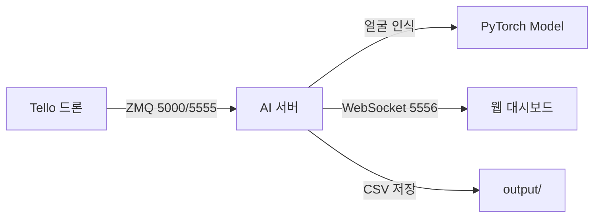

# 🚁 UHM-TENDANCE

**Tello 드론 연동 얼굴 인식 출석 시스템**

PyTorch 기반 실시간 얼굴 인식을 통해 Tello 드론의 ZMQ 영상 스트림을 분석하고, WebSocket으로 출석 결과를 방송하는 AI 서버입니다.

---

## ✨ 주요 기능

- **🎥 실시간 ZMQ 입력**: Tello 드론이 전송하는 JPEG 영상 스트림을 ZMQ PULL 소켓으로 수신
- **🤖 실시간 얼굴 인식**: PyTorch 모델로 매 프레임 얼굴을 인식하고 `students.json`과 대조
- **📡 실시간 WebSocket 방송**: 인식 결과(Base64 이미지, 좌표, 이름)를 JSON 형식으로 모든 클라이언트에 방송
- **📊 최종 리포트**: 종료 시 `output/` 폴더에 CSV 리포트 저장 및 `attendance_report` JSON 방송

---

## 🚀 설치 방법

### 1. 가상환경 및 패키지 설치

```bash
# icv 가상환경이 이미 있다고 가정
pip install -r requirements.txt
```

### 2. 필수 패키지 확인

`requirements.txt`에 다음 패키지들이 포함되어 있는지 확인하세요:

```
opencv-python
torch
torchvision
Pillow
numpy
websockets
pyzmq
djitellopy
ultralytics
```

---

## 📁 파일 구조

```
Uhm-Tendance/
├── 01_collect_data.py              # 학생 얼굴 데이터 수집
├── 02_train_model.py               # PyTorch 모델 학습
├── 03_run_attendance_server.py     # ⭐ 실제 AI 서버 (ZMQ → WS)
├── zmq_client_test_LOCAL.py        # 테스트: MacBook 웹캠 ZMQ PUSH
├── mock_server_PYTHON.py           # 테스트: Python WS PUSH
├── mock_server.js                  # 테스트: Node.js WS PUSH
├── face_model.py                   # PyTorch 모델 정의
├── student_manager.py              # 학생 정보 관리
├── haarcascade_frontalface_default.xml
├── requirements.txt
├── dataset/                        # 학생 얼굴 이미지
├── trainer/
│   └── model.pt                    # 학습된 모델
├── output/                         # 출석 기록 CSV
└── students.json                   # 학생 정보 (학번: 이름)
```

---

## 🎓 모델 학습 (선택)

`trainer/model.pt` 파일이 없는 경우, 먼저 모델을 학습해야 합니다.

```bash
# 1. 학생 얼굴 데이터 수집 (웹캠 필요)
python 01_collect_data.py

# 2. 모델 학습
python 02_train_model.py
```

---

## 🖥️ AI 서버 실행 방법

### A. 로컬 테스트 (MacBook)

> **참고**: macOS는 5000번 포트가 AirPlay와 충돌할 수 있어 **5555번 포트**를 사용합니다.

**터미널 1️⃣ : AI 서버 실행**

```bash
# ZMQ_PORT 환경변수 미설정 시 자동으로 5555번 포트 사용
/opt/anaconda3/envs/icv/bin/python 03_run_attendance_server.py
```

**예상 출력:**
```
[ZMQ] Setting up ZMQ PULL socket at tcp://*:5555
[WS Server 5556] WebSocket Server started at ws://0.0.0.0:5556
```

**터미널 2️⃣ : ZMQ 테스트 클라이언트 실행**

```bash
# 로컬 MacBook 웹캠 → ZMQ 5555번 포트로 전송
/opt/anaconda3/envs/icv/bin/python zmq_client_test_LOCAL.py
```

**예상 출력:**
```
[INFO] 연결 성공! tcp://127.0.0.1:5555
```

**결과 확인:**
- 웹 대시보드에서 `ws://localhost:5556` 접속
- 실시간 얼굴 인식 결과 확인

---

### B. 실제 서버 배포 (Production)

배포 서버(Linux 등)에서는 Tello 드론 기본 포트인 **5000번**을 사용합니다.

**서버 터미널: AI 서버 실행**

```bash
# 1. ZMQ_PORT 환경변수를 5000으로 설정
export ZMQ_PORT=5000

# 2. AI 서버 실행
python 03_run_attendance_server.py
```

**예상 출력:**
```
[ZMQ] Setting up ZMQ PULL socket at tcp://*:5000
[WS Server 5556] WebSocket Server started at ws://0.0.0.0:5556
```

**결과 확인:**
- Tello 드론 클라이언트를 `cam.uhmcv.kro.kr:5000`으로 연결
- 웹 대시보드에서 `ws://cam.uhmcv.kro.kr:5556` 접속

---

## 🔌 포트 정리

| 서비스 | 포트 | 설명 |
|--------|------|------|
| **ZMQ (Tello → AI서버)** | `5000` | 실서버용 - Tello 드론 원본 영상 |
| **ZMQ (Local Test)** | `5555` | macOS 로컬 테스트용 |
| **WebSocket (AI서버 → 웹)** | `5556` | AI 서버 방송 포트 (최종 결과) |

---

## 📝 사용 흐름



---

## 🎯 빠른 시작

```bash
# 1. 가상환경 활성화
conda activate icv

# 2. AI 서버 실행
python 03_run_attendance_server.py

# 3. (로컬 테스트) 웹캠 클라이언트 실행
python zmq_client_test_LOCAL.py

# 4. 웹 대시보드 접속
# ws://localhost:5556
```

---

**ICV-TEAM 4**